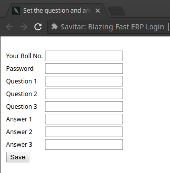

#  Savitar

Savitar: A lightning fast way to login into KGP ERP

It's time to move into the world of automation and, what's better place than our beloved old ERP. This chrome extension lets you log into ERP
automatically once you save your credentials in the application.

The application logs you into the KGP ERP when you visit the erp website and also skips the annoying form that comes up afterwards.

DISCLAIMER: We do not store your credentials, and the source code is provided to verify the same.

## What's New

Version 1.3 now adds support for automatically skipping the annoying ERP form popup.

## Installing Into Chrome
1. Clone or download the repository as zip from
[here](https://github.com/thealphadollar/savitar).
2. If you downloaded as zip, extract the files and folders.
3. Open your google chrome and goto `chrome://extensions`
4. Enable "developer mode" at the top right.
5. Click `LOAD UNPACKED` and select the `kgp_erp_extension` directory inside the cloned or unzipped folder.
6. Voila! You've the extension installed. Click on the icon, set the options and witness "god of speed".

7. Turn off "developer mode".

## Updating
1. Download the latest repository at the same place, or `git pull` the latest commit.
2. Open your google chrome and goto `chrome://extensions`
3. Update the current extension by clicking `update gear icon` on the extension.

NOTE: You can also opt for reinstalling the new version, old one will automatically be removed.

## Contributing
Contributions are welcome. Please use kgp_erp_extension.pem while repackaging the extension. 

## Help Wanted
To make the application available on Chrome WebStore, a payment of $5 is required for the developer's account. If you have an account
feel free to load `savitar.zip` into the WebStore.  

## Attributes
Based on [KGP ERP Extension](https://chrome.google.com/webstore/detail/erp-extension-for-kgpians/cpehhocmbickbkapejcdojbpbhpchocb), which doesn't work
anymore due to change in ERP's domain.

